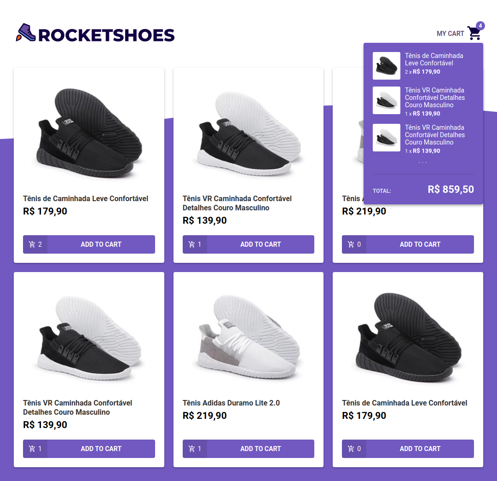
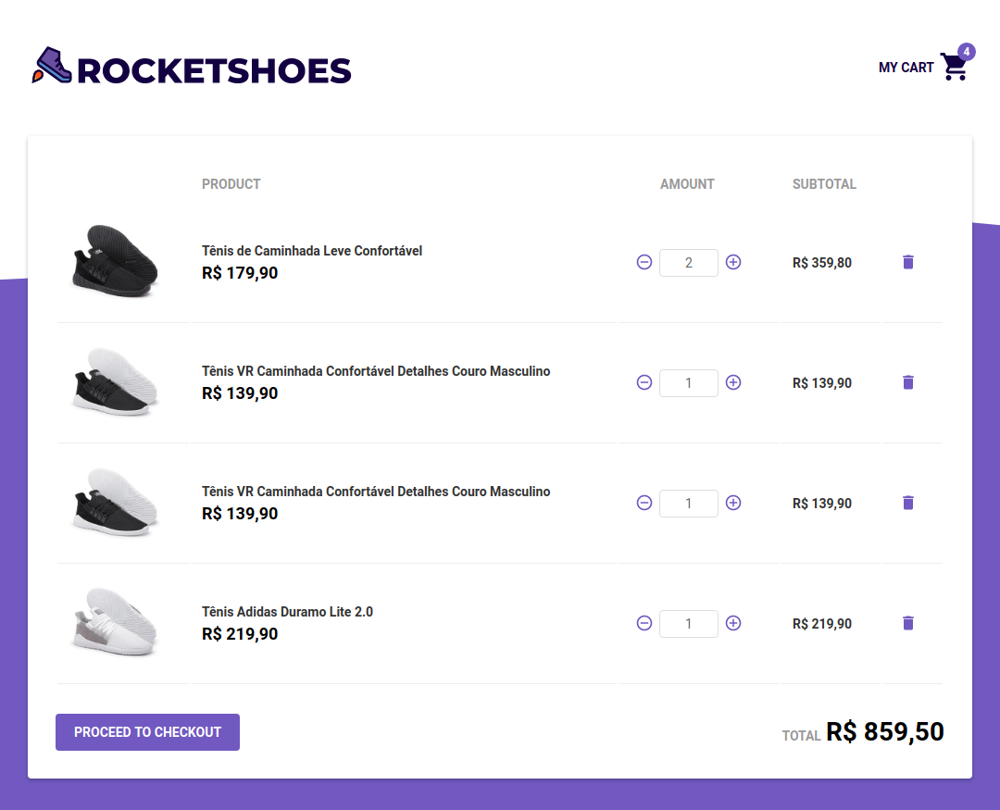

# RocketShoes
:shoe: Sample store built with Redux and Redux-Saga

### [Live Demo](https://luizbatanero-rocketshoes.netlify.com/)




## Running Locally

```sh
yarn install

# start the json-server api
yarn api:server

# start the app on a new terminal window
yarn start
```

Runs the app in development mode.<br>
Open [http://localhost:3000](http://localhost:3000) to view it in the browser.
